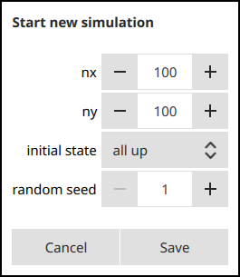

# GUI for view Monte-Carlo (MC) simulation of remagnetization process

This program is written with Qt5 and QWebEngine plug-in to visualize how dipoles can be arranged
with various temperature anisotropy and Zeeman field.

You can run simulation with arbitrary number of MC steps and visually observe the system on every step.
Also you can tune the parameters literally for every step of simulations.

You can **download** pre-build binaries here: [https://github.com/uyras/MonteCarloVisualisation/releases](https://github.com/uyras/MonteCarloVisualisation/releases)

**Windows installer is [here](https://github.com/uyras/MonteCarloVisualisation/releases/download/0.2/windows-x64-installer.exe)**

If you get error "vcruntime140.dll not found", first install [Visual C++ redistruable package](https://www.microsoft.com/ru-ru/download/details.aspx?id=48145).

* [Example](#example)
* [Model](#model)
* [Monte-carlo simulations](#monte-carlo-simulations)
* [Work-flow](#work-flow)
* [User interface](#user-interface)
 * ["Start new simulation" dialog](#start-new-simulation-dialog)
 * ["Add frames" dialog](#add-frames-dialog)
 * [Main interface](#main-interface)
* [TODO](#todo)
* [Thanks](#thanks)

## Example

This is the simulation of system with 100\*100 spins with low temperature (near 0K) and weak anisotropy along Z axis.

## Model

The build block of this model is point dipole. It has three-dimensional vector of magnetic moment and position coordinates. Magnetic moment is always unit-length. Such dipoles are placed on surface and arranged in shape of square lattice.

It interacts via ferromagnetic dipole-dipole interaction only with 4 nearest neighbors: top, bottom, left and right. Boundary conditions are open which means that, for example top left spin interacts only with 2 spins: bottom and right.

Also, model includes external magnetic field and anisotropy. These parameters are common for all dipoles.

The distance between nearest dipoles is always 1, and can not be changed. Positions of dipoles are hardly defined and also can not be changed during simulations. 

## Monte-carlo simulations

The program uses [Metropolis–Hastings algorithm](https://en.wikipedia.org/wiki/Metropolis%E2%80%93Hastings_algorithm) with very typical probabilities. One Monte-Carlo step (MCS) means sequence of _N_ random trials of random magnetic moment rotates. Every single rotate deviates the vector M to random direction and random distance, but no more than 0.1 (in relative units). 

## Work-flow

The typical work-flow is as follows: you set up the system size and it's initial state, and iteratively add frames to animation with varied parameters.

Then, you can navigate through already calculated frames and see how system parameters are changing.

For example, you start with random system of _10\*10_ size and random ordering. Then, bring the temperature to low and run 100 steps to somehow order the system (lowdown the energy). Then add external field and increase the temperature up to room, and simulate 1000 steps (10 times longer than before). Then add anisotropy along Z axis and simulate 10000 steps with near-0 temperature.

The program gives you a wide range of possible variants. Physicality of tuned parameters is up to you.

## User interface

### "Start new simulation" dialog

You can consider this dialog as "main settings". It is the first what you will see when start the program.

This dialog requires main parameters of system, such as:
* _nx_ and _ny_ - number of spins along X and Y axes. The total size of system will be .
* _initial state_ - the basic configuration from which you will start the simulation. It is important parameter, such as dipole-dipole interaction itself in ground state will be arranged in chessboard order (one up, one down). And in such case further simulation will not change anything.
* _random seed_ - init point for pseudo-random number generator, [read here](https://en.wikipedia.org/wiki/Random_seed). This setting is here to provide repeatability of result. Usually this value is dependent on time. Despite Monte-Carlo is random algorithm, you will get the same result by running program with same parameters and same _random seed_.

By clicking on _save_ button previous system and history of simulation will reset. You will be needed to make as minimum 1 MC step to see the visualization.

### "Add frames" dialog

You will see this dialog every time when need to add new frames to animation. New animation always starts from the point where previous one finishes.
All units in this dialog are relative.

* _frames count_ - number of frames which you need to simulate
* _T_ - temperature. Can't be 0
* _H_ - the length of vector of external field.
* _H vector_ - the direction of vector of external field. Here is 3 fields: _x_, _y_ and _z_ components. It is better to be unit-length because internally the resulting vector is the production of parameters _H_ and _H vector_.
* _anisotropy_ - anisotropy constant,
* _anisotropy_vector_ - the same as _H vector_ but for anisotropy for each spin.

The MC simulation starts right after you press _Save_ button and might be canceled at any time. All already calculated frames will be saved and available on time lime.

### Main interface

1. Rendered image of the system for current step. Each arrow represent a point dipole, color is basing on _Z_-component of magnetic moment and it is red when _Mz_ -> 1, white when _Mz_ -> 0 and blue when _Mz_ -> -1. You can drag it to change the angle of view.
2. Settings menu. Here you can show/hide a plot, and change visible lines on it. Options comes available when it's value was changed at least once. On screen _T_ is disabled because simulation was performed in constant temperature.
3. Sphere and coordinate axis. Sphere shows the distribution of M vectors.
4. Plot synced with time line. You can adjust it's height by dragging the left edge. Double click on plot area changes the scale of time line.
5. Time line. Like in any video player.
6. Settings buttons. Calls "Add frames" and "Start new simulation" dialogs, respectively.
7. Playback controls. Nothing unusual.
8. Additional buttons, from left to right: current frame /  total frames, center viewport, save image (not working now). 

## TODO
* add save and load to JSON file functions
* export to video file
* add opportunity to change the center point of viewport. Now it is fixed on geometrical center of lattice
* improve the Hi-DPI support
* add opportunity to change the color scheme of arrows
* add function to convert all units to relative/absolute values on the fly
* add triangular lattice
* add interaction range (nearest or next-nearest neighbor)

## Thanks
* The [WebGlSpins](https://github.com/FlorianRhiem/WebGLSpins.js/) JavaScript library is used for fast rendering of big arrays of spins. Really fast, effective and easy.
* Prof. Dr. [Markus Münzenberg](https://physik.uni-greifswald.de/en/research-groups/interface-and-surface-physics-prof-markus-muenzenberg/team/team/group-members/markus/), Greifswald University, Greifswald, Germany. For valuable discussions and collaboration.